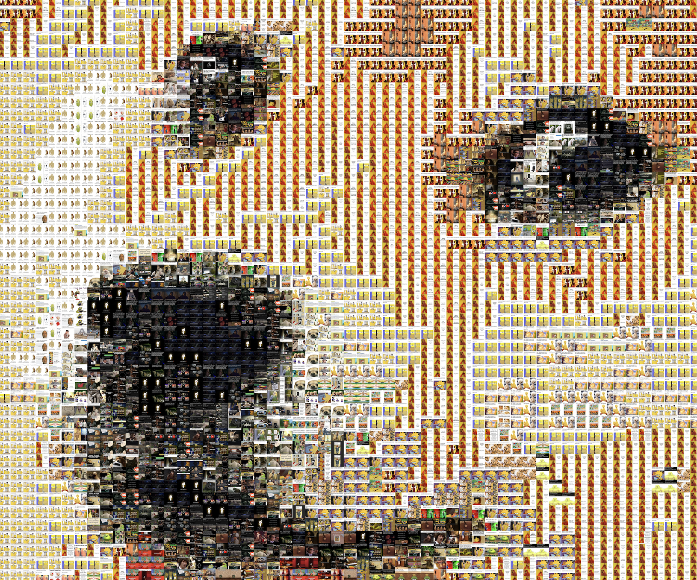

# Photomosaic Generator

Generates a [photomosaic](https://en.wikipedia.org/wiki/Photographic_mosaic) from a source image and a set of tiles.





## Pre-requisites

- [Node.js](https://nodejs.org/en/)
- [Yarn](https://yarnpkg.com/en/)
- [ImageMagick](https://www.imagemagick.org/script/download.php)

## Instalation

```bash
$ yarn install
```

## Usage

```bash
$ ./photomosaic.js -s source-image.jpeg -t tiles-folder-path -o output-image.png
```
Example:
```bash
$ ./photomosaic.js -s doge.jpeg -t ./memes -o ./mosaic-doge.png
```

## Disclaimers

Tiles are resized to squares of 100x100 pixels. Meaning that the size of your ouput image will be: (source image width * 100)x(source image height * 100) pixels.

This is a very naive implementation, definitely not optimized for performance be mindful about the size of the source image and the number of tiles.
